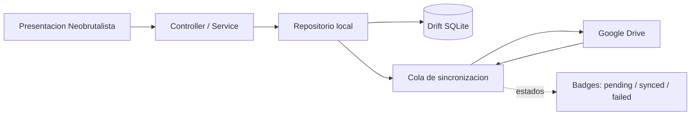

# Skill Maestra — Flutter Neobrutalist UI (Sigma Academy)

> **Especificación canónica de diseño y arquitectura frontend.**
> Todo desarrollo o refactor de UI en `front/lib` debe cumplir este documento.
> Si una pantalla no cumple, no está terminada.

| Campo | Valor |
| --- | --- |
| Proyecto | Sigma Academy (`tallerintegracion3`) |
| Alcance | `front/lib/**` (core/theme, core/common_widgets, core/widgets, features/*) |
| Plataformas | Windows 11, macOS, Android (teléfono/tablet/foldable) y Web |
| Stack | Flutter + Dart (SDK ^3.11.4), Drift SQLite local-first, delegación a Google Drive |
| Fuente de verdad de tokens | `front/lib/core/theme/app_theme.dart` |
| Versión de la skill | 1.0.0 (2026-09-21) |
| Audiencia | Desarrolladores humanos y agentes de IA que generan o revisan UI |

---

## 0. Índice

1. [Manifiesto neobrutalista/retro](#1-manifiesto-neobrutalistaretro)
2. [Paleta de colores y Design Tokens](#2-paleta-de-colores-y-design-tokens)
3. [Sistema de responsividad multiplataforma](#3-sistema-de-responsividad-multiplataforma)
4. [Catálogo de componentes base](#4-catálogo-de-componentes-base)
5. [Arquitectura y buenas prácticas](#5-arquitectura-y-buenas-prácticas)
6. [Checklist de auditoría para nuevas pantallas](#6-checklist-de-auditoría-para-nuevas-pantallas)
7. [Apéndice: deuda visual detectada y plan de normalización](#7-apéndice-deuda-visual-detectada-y-plan-de-normalización)

---

## 1. Manifiesto neobrutalista/retro

### 1.1 Qué es (y qué no es)

El neobrutalismo de Sigma Academy es la traducción digital de los materiales físicos
de la academia retro: **papel pergamino, fotocopias técnicas, sellos de tinta,
etiquetas de laboratorio y terminales de los 80s/90s**. La interfaz debe sentirse
como una superficie tangible que se puede tocar, presionar y apilar; cada componente
es una pieza física con borde impreso y sombra proyectada, nunca una mancha difusa.

**Es:**

- Alto impacto visual y jerarquía agresiva (títulos pesados, acentos tipo resaltador).
- Honestidad material: bordes sólidos de 2–3 px, cajas nítidas, esquinas de 90 grados.
- Sombra dura y desplazada que simula una pieza de cartón elevada sobre el escritorio.
- Microinteracciones mecánicas: al presionar, la pieza se hunde (se traslada hacia su
  sombra) y recupera su altura al soltar.
- Un lenguaje multiplataforma único: la misma identidad en Windows 11, macOS, Android y Web.

**No es:**

- Glassmorphism, neumorfismo, degradados de sombra, `BackdropFilter` decorativo.
- Bordes redondeados tipo píldora, tarjetas "flotando" con blur, sombras suaves.
- Material Design 3 genérico: el ripple/difuminado estándar se desactiva o sustituye.
- Una excusa para bajar accesibilidad: el contraste y el foco visual son obligatorios.

### 1.2 Los siete principios rectores

1. **Materialidad explícita.** Si un elemento es interactivo o contenedor, debe verse
   su borde y su sombra dura. Sin ambigüedad de profundidad.
2. **Sombra dura, jamás difusa.** `blurRadius: 0` y `spreadRadius: 0` son obligatorios
   en todo el sistema. La profundidad se comunica con el offset, no con desenfoque.
3. **Esquinas honestas.** Estructura a 90° (`AppDimens.radius = 0`). Solo badges,
   chips y tags pueden redondear 4–6 px. Nunca píldoras ovales.
4. **Tinta y papel primero.** La paleta nace del pergamino (`#F5F0E8`), el blanco de
   etiqueta (`#FFFFFF`) y la tinta negra (`#1A1A1A`). El color es acento, no decoración.
5. **Acento con propósito.** Amarillo resaltador = atención/selección/acción primaria.
   Azul cobalto = información/enlaces. Rojo = peligro/error. Verde = aprobado.
6. **Respuesta mecánica.** Toda acción tiene feedback físico inmediato (<100 ms):
   hundimiento, inversión de color o aparición de borde de foco.
7. **Multiplataforma sin concesiones.** La densidad y la navegación se adaptan al
   tamaño, pero los tokens (color, borde, sombra, tipografía) nunca cambian.

### 1.3 Tabla Do / Don't

| Correcto (Do) | Prohibido (Don't) |
| --- | --- |
| `BoxShadow(color: AppColors.border, offset: Offset(4,4), blurRadius: 0, spreadRadius: 0)` | `BoxShadow(blurRadius: 12, color: Colors.black26)` |
| `BorderRadius.circular(0)` en tarjetas, modales e inputs | `BorderRadius.circular(24)` en tarjetas |
| `Border.all(color: AppColors.border, width: 2)` | `Border.all(color: Colors.grey.shade300)` |
| `AppColors.accentYellow` para selección | `Colors.yellow` o `Color(0xFFFFD54F)` sueltos |
| Presión con traslación `Offset(3,3) → Offset(0,0)` | Ripple Material por defecto sobre tarjetas |
| Labels en `UPPERCASE` con `FontWeight.w900` | Labels en title case con peso ligero |
| `MouseRegion(cursor: SystemMouseCursors.click)` en desktop | Interactivos sin cambio de cursor |
| Contraste verificado (≥ 7:1 cuando sea posible) | Texto gris claro sobre crema |

---

## 2. Paleta de colores y Design Tokens

### 2.1 Fuente de verdad

Todos los colores, medidas, sombras y duraciones viven **exclusivamente** en:

```text
front/lib/core/theme/app_theme.dart      -> AppColors, AppDimens, AppShadows, AppMotion, AppTheme
front/lib/core/common_widgets.dart       -> AppFieldLabel, appInputDecoration
front/lib/core/widgets/neobrutalism.dart -> catálogo de componentes (sección 4)
```

Regla dura: **ninguna pantalla de `front/lib/features/**` puede declarar colores hex,
`Colors.*` ni offsets de sombra literales**. Siempre `AppColors` / `AppShadows` /
`AppDimens`. La única excepción permitida es un color dinámico proveniente del
backend o de una paleta de datos del usuario, y aun así debe pasar por `AppColors`.

### 2.2 Paleta canónica

| Token | Hex | Rol | Uso permitido | Contraste medido |
| --- | --- | --- | --- | --- |
| `AppColors.bg` | `#F5F0E8` | Canvas pergamino | Fondo de `Scaffold`, inputs rellenos, zonas bajas | Texto `text` sobre él: **15.3:1** |
| `AppColors.surface` | `#FFFFFF` | Superficie de tarjeta | Tarjetas, modales, sidebar, app bar | Texto `text`: **17.4:1** |
| `AppColors.surfaceLow` | `#F2EDE5` | Relieve/bajo | Headers de tabla, celdas alternas, estados disabled | Texto `text`: **14.6:1** |
| `AppColors.border` | `#1A1A1A` | Tinta/borde | Todos los bordes, sombras duras, botón primario | — |
| `AppColors.text` | `#1A1A1A` | Texto primario | Títulos, cuerpo, labels | Sobre `surface`: **17.4:1** |
| `AppColors.muted` | `#555555` | Texto secundario | Subtítulos, metadatos ≥ 14 px | Sobre `surface`: **7.5:1**; sobre `bg`: **6.6:1 (AA)** |
| `AppColors.mutedStrong` | `#444444` | Secundario AAA | Texto de soporte pequeño sobre `bg` | Sobre `bg`: **8.6:1** |
| `AppColors.accentYellow` | `#FFCC00` | Highlighter | Selección, CTA, badges de progreso | Texto `text`: **11.5:1** |
| `AppColors.accentBlue` | `#0055FF` | Cobalto | Enlaces, acciones informativas, avatares | Blanco: 5.6:1 (AA, usar negrita) |
| `AppColors.accentBlueDeep` | `#0033CC` | Cobalto AAA | Fondos azules con texto blanco | Blanco: **9.0:1** |
| `AppColors.error` | `#E63B2E` | Peligro | Borde de error, badges de reprobado | Reservar como borde/acento |
| `AppColors.errorDeep` | `#8B1A12` | Peligro AAA | Fondo de botón/badge destructivo | Blanco: **9.3:1** |
| `AppColors.success` | `#2ECC71` | Aprobado | Badges/fills de aprobado | Texto `text`: **8.3:1** |
| `AppColors.successDeep` | `#25A25A` | Verde profundo | Bordes/íconos de acento verde | Solo acento, no texto pequeño |
| `AppColors.pending` | `#9E9E9E` | Pendiente | Bordes/dots de estado pendiente | Texto `text`: 6.5:1 (AA) |
| `AppColors.pendingLight` | `#BDBDBD` | Pendiente AAA | Fondo de badge pendiente | Texto `text`: **9.3:1** |
| `AppColors.discord` | `#5865F2` | Comunidad | Acento social/chat, avatares | Blanco: 4.6:1 (AA, usar negrita) |
| `AppColors.scrim` | `#8C1A1A1A` | Velo modal | `barrierColor` de modales y sheets | — |

### 2.3 Estados académicos (alias semánticos)

| Estado | Token de relleno | Hex | Texto | Notas |
| --- | --- | --- | --- | --- |
| Aprobado | `AppColors.gradeApproved` (= `success`) | `#2ECC71` | `text` | 8.3:1, AAA |
| En progreso | `AppColors.gradeInProgress` (= `accentYellow`) | `#FFCC00` | `text` | 11.5:1, AAA |
| Reprobado | `AppColors.gradeFailed` (= `errorDeep`) | `#8B1A12` | `surface` | 9.3:1, AAA |
| Pendiente | `AppColors.gradePending` (= `pendingLight`) | `#BDBDBD` | `text` | 9.3:1, AAA |

Regla: el estado **siempre** se acompaña de etiqueta textual (no solo color), para no
depender de la percepción cromática.

### 2.4 `app_theme.dart` objetivo (tokens completos)

Aplicar esta ampliación (mantiene compatibilidad con los tokens ya existentes):

```dart
// Ruta: front/lib/core/theme/app_theme.dart
import 'package:flutter/material.dart';

/// Paleta canónica Sigma Academy (neobrutalismo retro).
/// Prohibido declarar colores sueltos fuera de este archivo.
class AppColors {
  AppColors._();

  // Superficies
  static const Color bg = Color(0xFFF5F0E8); // Canvas pergamino
  static const Color surface = Color(0xFFFFFFFF); // Tarjetas/etiquetas
  static const Color surfaceLow = Color(0xFFF2EDE5); // Relieve, filas alternas
  static const Color scrim = Color(0x8C1A1A1A); // Velo de modales

  // Tinta
  static const Color border = Color(0xFF1A1A1A);
  static const Color text = Color(0xFF1A1A1A);
  static const Color muted = Color(0xFF555555);
  static const Color mutedStrong = Color(0xFF444444); // AAA sobre bg

  // Acentos
  static const Color accentYellow = Color(0xFFFFCC00); // Highlighter
  static const Color accentBlue = Color(0xFF0055FF); // Cobalt
  static const Color accentBlueDeep = Color(0xFF0033CC); // AAA con blanco
  static const Color discord = Color(0xFF5865F2); // Comunidad/social

  // Semánticos
  static const Color error = Color(0xFFE63B2E);
  static const Color errorDeep = Color(0xFF8B1A12); // AAA con blanco
  static const Color success = Color(0xFF2ECC71);
  static const Color successDeep = Color(0xFF25A25A);
  static const Color pending = Color(0xFF9E9E9E);
  static const Color pendingLight = Color(0xFFBDBDBD); // AAA con negro

  // Estado académico (alias, nunca hex sueltos en features)
  static const Color gradeApproved = success;
  static const Color gradeInProgress = accentYellow;
  static const Color gradeFailed = errorDeep;
  static const Color gradePending = pendingLight;
}

/// Medidas, radios, breakpoints y layout.
class AppDimens {
  AppDimens._();

  // Bordes
  static const double borderWidth = 2; // Estándar estructural
  static const double borderWidthThick = 3; // Botones de acción y modales

  // Radios (0 = 90 grados; chips excepcionales)
  static const double radius = 0;
  static const double radiusChip = 4;
  static const double radiusSoft = 6; // máximo permitido, nunca estructural

  // Breakpoints unificados
  static const double breakpointCompact = 600;
  static const double breakpointMedium = 1024;
  static const double breakpointDesktop = breakpointMedium; // compatibilidad

  // Shell / layout
  static const double sidebarExpanded = 280;
  static const double sidebarCollapsed = 72;
  static const double contentMaxWidth = 1280; // rango permitido 1200–1400
  static const double gutter = 16;

  // Escala de espaciado
  static const double spaceXs = 4;
  static const double spaceSm = 8;
  static const double spaceMd = 12;
  static const double spaceLg = 16;
  static const double spaceXl = 24;
  static const double spaceXxl = 32;
  static const double spaceHero = 48;
}

/// Sombras duras canónicas (blur y spread SIEMPRE en 0).
class AppShadows {
  AppShadows._();

  static const Offset offsetBadge = Offset(2, 2);
  static const Offset offsetButton = Offset(3, 3);
  static const Offset offsetCard = Offset(4, 4);
  static const Offset offsetHero = Offset(6, 6); // modales/hero, uso excepcional

  static const BoxShadow hard2 = BoxShadow(
    color: AppColors.border,
    offset: offsetBadge,
    blurRadius: 0,
    spreadRadius: 0,
  );
  static const BoxShadow hard3 = BoxShadow(
    color: AppColors.border,
    offset: offsetButton,
    blurRadius: 0,
    spreadRadius: 0,
  );
  static const BoxShadow hard4 = BoxShadow(
    color: AppColors.border,
    offset: offsetCard,
    blurRadius: 0,
    spreadRadius: 0,
  );
  static const BoxShadow hard6 = BoxShadow(
    color: AppColors.border,
    offset: offsetHero,
    blurRadius: 0,
    spreadRadius: 0,
  );

  static const List<BoxShadow> badge = <BoxShadow>[hard2];
  static const List<BoxShadow> button = <BoxShadow>[hard3];
  static const List<BoxShadow> card = <BoxShadow>[hard4];
  static const List<BoxShadow> dialog = <BoxShadow>[hard6];

  /// Sombra condicional: vacía cuando la pieza está presionada o deshabilitada.
  static List<BoxShadow> pressed(bool isPressed, {BoxShadow base = hard3}) =>
      isPressed ? const <BoxShadow>[] : <BoxShadow>[base];
}

/// Duraciones y curvas del sistema de movimiento.
class AppMotion {
  AppMotion._();

  static const Duration press = Duration(milliseconds: 90);
  static const Duration fast = Duration(milliseconds: 120);
  static const Duration medium = Duration(milliseconds: 180);
  static const Duration expand = Duration(milliseconds: 220);

  static const Curve standard = Curves.easeOutCubic;
  static const Curve shell = Curves.easeInOut;
}

class AppTheme {
  AppTheme._();

  static ThemeData get light => ThemeData(
        scaffoldBackgroundColor: AppColors.bg,
        fontFamily: 'sans-serif',
        // Sin ripple Material: el feedback lo da el hundimiento neobrutalista.
        splashFactory: NoSplash.splashFactory,
        highlightColor: Colors.transparent,
        colorScheme: ColorScheme.fromSeed(
          seedColor: AppColors.accentYellow,
          surface: AppColors.surface,
          error: AppColors.error,
        ),
      );
}
```

### 2.5 Tabla de medidas y sombras

| Elemento | Borde | Radio | Sombra | Offset |
| --- | --- | --- | --- | --- |
| Tarjeta (`NeobrutalistCard`) | 2 px | 0 | `hard4` | `(4, 4)` |
| Botón (`NeobrutalistButton`) | 2 px | 0 | `hard3` (0 al presionar) | `(3, 3)` |
| Botón de modal / CTA destructiva | 3 px | 0 | `hard3` | `(3, 3)` |
| Input (`NeobrutalistTextField`) | 2 px (3 px focus borde) | 0 | `hard2` | `(2, 2)` |
| Badge / chip / tag | 1.5 px | 4 px | `hard2` | `(2, 2)` |
| Diálogo | 3 px | 0 | `hard6` | `(6, 6)` |
| Bottom sheet | 3 px (lado superior) | 0 | — (anclado) | — |
| Sidebar | 2 px (derecho) | 0 | — | — |
| Avatar cuadrado | 2 px | 6 px | `hard2` | `(2, 2)` |
| Hero / ilustración | 2 px | 0 | `hard6` | `(6, 6)` |

### 2.6 Tipografía canónica

| Rol | Tamaño | Peso | Tracking | Transform | Color |
| --- | --- | --- | --- | --- | --- |
| Título de pantalla | 20–24 | `w900` | −0.5 | original | `text` |
| Título de tarjeta/sección | 13–16 | `w900` | 0.5–0.6 | `UPPERCASE` | `text` |
| Label de campo (`AppFieldLabel`) | 12 | `w900` | 0.5 | `UPPERCASE` | `text` |
| Cuerpo | 13–14 | `w700` | 0 | original | `text` |
| Secundario | 12–13 | `w600`/`w700` | 0 | original | `muted` / `mutedStrong` |
| Botón | 13 | `w800`–`w900` | 0.5 | `UPPERCASE` | según variante |
| Badge/chip | 11 | `w900` | 0.6 | `UPPERCASE` | según tono |
| Contadores/IDs técnicos | 12–13 | `w800` | 0.5 | original | `text`, `fontFamily: 'monospace'` |

Reglas: nunca pesos `< w600` para información; nunca más de dos tamaños en una misma
tarjeta; los títulos de sección se separan con `Divider` de tinta (`thickness: 2`).

### 2.7 Escala de espaciado y layout

| Token | Valor | Uso |
| --- | --- | --- |
| `spaceXs` | 4 | Separación ícono–texto en chips |
| `spaceSm` | 8 | Gaps internos pequeños |
| `spaceMd` | 12 | Padding de botones, gaps entre campos |
| `spaceLg` | 16 | Padding estándar de tarjetas y pantallas |
| `spaceXl` | 24 | Separación entre bloques |
| `spaceXxl` | 32 | Separación entre secciones |
| `spaceHero` | 48 | Hero/empty states |

Regla: en desktop, aplicar padding externo `spaceXl` sobre un contenedor centrado de
ancho máximo `AppDimens.contentMaxWidth`. En mobile, `spaceLg` y `SafeArea`.

### 2.8 Reglas de color

1. El fondo de toda pantalla es `AppColors.bg`; nunca `Colors.white` directo.
2. Las tarjetas son `surface` (blanco puro) para máximo contraste con el pergamino.
3. La selección siempre es `accentYellow` con borde de tinta y sombra `hard2`.
4. El botón primario es tinta sólida (`border`) con texto `surface`; el CTA
   destacado usa `accentYellow`; la acción destructiva usa `errorDeep`.
5. Los enlaces y acciones informativas usan `accentBlue`; si el fondo es azul con
   texto blanco, usar `accentBlueDeep` (AAA).
6. Prohibido usar `Colors.black`, `Colors.white`, `Colors.grey*` o hex literales en
   `features/**`.

---

## 3. Sistema de responsividad multiplataforma

### 3.1 Breakpoints canónicos

| Nombre | Rango | Dispositivos | Navegación | Densidad |
| --- | --- | --- | --- | --- |
| `compact` | `< 600 dp` | Android vertical, ventanas estrechas | Bottom nav neobrutalista + Drawer de respaldo | 1 columna, acciones en FAB/Bottom Action Bar |
| `medium` | `600–1024 dp` | Tablets, foldables, ventanas redimensionadas | Drawer o sidebar colapsado (72 dp) | 1–2 columnas, split ligero |
| `expanded` | `> 1024 dp` | Windows 11, macOS, pantallas panorámicas | Sidebar fija 280 dp / 72 dp colapsada | Grid multi-columna, contenido centrado |

> **Unificación obligatoria:** los valores `600` y `1024` provienen de
> `AppDimens.breakpointCompact` y `AppDimens.breakpointMedium`. Está prohibido usar
> `768` u otros números mágicos para decidir layout (ver deuda en apéndice 7).

### 3.2 Helpers de responsividad (código canónico)

```dart
// Ruta: front/lib/core/widgets/neobrutalism.dart
import 'package:flutter/material.dart';

import '../theme/app_theme.dart';

enum AppBreakpoint { compact, medium, expanded }

extension AppBreakpointContext on BuildContext {
  double get _width => MediaQuery.sizeOf(this).width;

  AppBreakpoint get breakpoint {
    if (_width < AppDimens.breakpointCompact) return AppBreakpoint.compact;
    if (_width <= AppDimens.breakpointMedium) return AppBreakpoint.medium;
    return AppBreakpoint.expanded;
  }

  bool get isCompact => breakpoint == AppBreakpoint.compact;
  bool get isMedium => breakpoint == AppBreakpoint.medium;
  bool get isExpanded => breakpoint == AppBreakpoint.expanded;
  bool get isDesktop => breakpoint == AppBreakpoint.expanded;
  bool get isTouchFirst => breakpoint == AppBreakpoint.compact;
}

/// Construye UI según el breakpoint activo.
class ResponsiveBuilder extends StatelessWidget {
  const ResponsiveBuilder({super.key, required this.builder});

  final Widget Function(BuildContext context, AppBreakpoint breakpoint) builder;

  @override
  Widget build(BuildContext context) => builder(context, context.breakpoint);
}

/// Centra y limita el ancho del contenido en pantallas expandidas:
/// evita que tablas y textos se deformen en monitores ultra-wide (1440p/4K).
class MaxWidthContainer extends StatelessWidget {
  const MaxWidthContainer({
    super.key,
    required this.child,
    this.maxWidth = AppDimens.contentMaxWidth,
    this.padding = const EdgeInsets.all(AppDimens.spaceXl),
    this.alignment = Alignment.topCenter,
  });

  final Widget child;
  final double maxWidth;
  final EdgeInsetsGeometry padding;
  final AlignmentGeometry alignment;

  @override
  Widget build(BuildContext context) {
    return Align(
      alignment: alignment,
      child: ConstrainedBox(
        constraints: BoxConstraints(maxWidth: maxWidth),
        child: Padding(padding: padding, child: child),
      ),
    );
  }
}

/// Envoltorio táctil de escritorio: cursor click en áreas interactivas.
class ClickCursor extends StatelessWidget {
  const ClickCursor({super.key, required this.child, this.enabled = true});

  final Widget child;
  final bool enabled;

  @override
  Widget build(BuildContext context) {
    return MouseRegion(
      cursor: enabled ? SystemMouseCursors.click : MouseCursor.defer,
      child: child,
    );
  }
}
```

### 3.3 Pautas específicas de Desktop (Windows 11 / macOS)

**Shell canónico:** `Scaffold` con `AppBar` de borde inferior de tinta y sidebar fija
que alterna 280 dp ↔ 72 dp con `AnimatedContainer` (`AppMotion.expand`,
`Curves.easeInOut`). En estado colapsado, cada ítem muestra `Tooltip`.

```dart
Widget buildDesktopShell(BuildContext context, {required Widget content}) {
  return Row(
    crossAxisAlignment: CrossAxisAlignment.stretch,
    children: <Widget>[
      AnimatedContainer(
        duration: AppMotion.expand,
        curve: AppMotion.shell,
        width: collapsed ? AppDimens.sidebarCollapsed : AppDimens.sidebarExpanded,
        decoration: const BoxDecoration(
          color: AppColors.surface,
          border: Border(
            right: BorderSide(color: AppColors.border, width: AppDimens.borderWidth),
          ),
        ),
        child: collapsed ? buildCollapsedRail(context) : buildSidebar(context),
      ),
      Expanded(child: MaxWidthContainer(child: content)),
    ],
  );
}
```

**Contenedor máximo:** toda vista de contenido desktop debe pasar por
`MaxWidthContainer` (1200–1400 dp, canónico 1280). Nunca estirar tablas ni párrafos
de borde a borde en ultra-wide.

**Ergonomía de cursor:** `ClickCursor` o `MouseRegion(cursor: SystemMouseCursors.click)`
en cada zona interactiva (tarjetas clicables, tiles, botones, chips). Elementos
deshabilitados usan `SystemMouseCursors.forbidden`.

**Atajos de teclado y foco:**

```dart
// Requiere: import 'package:flutter/services.dart'; para LogicalKeyboardKey.
// Atajos recomendados: Ctrl+N (nuevo), Ctrl+S (guardar), Esc (cerrar/cancelar).
class KeyboardShortcutsScope extends StatelessWidget {
  const KeyboardShortcutsScope({
    super.key,
    required this.child,
    this.onNew,
    this.onSave,
    this.onEscape,
  });

  final Widget child;
  final VoidCallback? onNew;
  final VoidCallback? onSave;
  final VoidCallback? onEscape;

  @override
  Widget build(BuildContext context) {
    return CallbackShortcuts(
      bindings: <ShortcutActivator, VoidCallback>{
        const SingleActivator(LogicalKeyboardKey.keyN, control: true): () => onNew?.call(),
        const SingleActivator(LogicalKeyboardKey.keyS, control: true): () => onSave?.call(),
        const SingleActivator(LogicalKeyboardKey.escape): () => onEscape?.call(),
      },
      child: Focus(autofocus: true, child: child),
    );
  }
}
```

**Foco visual:** el elemento enfocado por teclado invierte colores (fondo tinta,
texto superficie) o duplica el borde; nunca usa un halo difuso. `NeobrutalistButton`
ya implementa inversión de foco (sección 4.1).

### 3.4 Pautas específicas de Mobile (Android)

- **Ergonomía del pulgar:** acción primaria en `floatingActionButton` neobrutalista
  (cuadrado, borde 2 px, sombra `hard3`) o en Bottom Action Bar; nunca en la esquina
  superior.
- **Navegación adaptativa:** `compact` usa Bottom Navigation neobrutalista; si hay
  más de 5 destinos, Drawer. `medium` puede usar Drawer.
- **Teclado y desbordes:** `resizeToAvoidBottomInset: true` en el `Scaffold` y
  `SingleChildScrollView(physics: const BouncingScrollPhysics())` en el cuerpo del
  formulario. Prohibido dejar `Column` desnuda bajo el teclado.
- **SafeArea integral:** envolver cuerpo y bottom sheets con `SafeArea` para
  muescas, islas dinámicas y barra gestual.
- **Edición y detalle:** usar `showNeobrutalistBottomSheet` (modal/draggable) en
  lugar de split views. Los formularios largos van en bottom sheet
  `isScrollControlled: true` con `DraggableScrollableSheet`.

```dart
Scaffold(
  resizeToAvoidBottomInset: true,
  backgroundColor: AppColors.bg,
  floatingActionButton: NeobrutalistIconButton(
    icon: Icons.add_rounded,
    tooltip: 'Nuevo',
    variant: NeobrutalistButtonVariant.accent,
    onPressed: () => showNeobrutalistBottomSheet<void>(
      context: context,
      title: 'Nuevo apunte',
      child: const NoteEditorForm(),
    ),
  ),
  body: SafeArea(
    child: SingleChildScrollView(
      physics: const BouncingScrollPhysics(),
      child: content,
    ),
  ),
);
```

### 3.5 Matriz componente × plataforma

| Componente | Compact (Android) | Medium (tablet/foldable) | Expanded (Win/macOS) |
| --- | --- | --- | --- |
| Navegación global | Bottom nav / Drawer | Drawer o rail 72 dp | Sidebar 280 ↔ 72 dp con Tooltip |
| Acción primaria | FAB o Bottom Action Bar | FAB o toolbar | Toolbar + atajo Ctrl+N |
| Listas | 1 columna, tarjetas full-width | 1–2 columnas | Grid 2–4 columnas centrado ≤1280 |
| Detalle/edición | Bottom sheet draggable | Bottom sheet o side panel | Diálogo neobrutalista o split |
| Confirmaciones | Bottom sheet | Diálogo | Diálogo + Esc |
| Tooltips | No aplica (long-press) | Tooltip | Tooltip obligatorio en rail |
| Cursor | No aplica | click | click/forbidden explícitos |

---

## 4. Catálogo de componentes base

### 4.0 Convenciones del catálogo

Todos los componentes viven en un único archivo compartido:

```text
front/lib/core/widgets/neobrutalism.dart
```

Encabezado obligatorio del archivo (los bloques de esta sección son clases del
mismo archivo, en el orden en que se presentan):

```dart
import 'package:flutter/material.dart';
import 'package:flutter/services.dart';

import '../common_widgets.dart';
import '../theme/app_theme.dart';
```

| Componente | Clase(s) | Uso principal |
| --- | --- | --- |
| Botón | `NeobrutalistButton` | CTA, acciones de formulario, toolbar |
| Botón ícono | `NeobrutalistIconButton` | FAB mobile, acciones compactas de toolbar |
| Tarjeta | `NeobrutalistCard` | Contenedores de contenido, paneles, list items |
| Campo de texto | `NeobrutalistTextField` | Formularios con `AppFieldLabel` |
| Badge / chip | `NeobrutalistBadge`, `StickerChip` | Estados, categorías, filtros seleccionables |
| Diálogo | `NeobrutalistDialog` + `showNeobrutalistDialog` | Confirmaciones y edición breve |
| Bottom sheet | `NeobrutalistBottomSheet` + `showNeobrutalistBottomSheet` | Detalle/edición mobile y tablet |
| Helpers | `AppBreakpoint`, `ResponsiveBuilder`, `MaxWidthContainer`, `ClickCursor` | Responsividad y ergonomía |

Reglas transversales:

1. Ningún componente introduce `blurRadius > 0` ni `spreadRadius > 0`.
2. Ningún componente usa `Colors.*` para color de marca (solo `Colors.transparent`
   para hacer invisible el contenedor del `Dialog`).
3. Todo interactivo expone estado `pressed`, `focused`, `disabled` y cursor de ratón.
4. Todo texto respeta la escala tipográfica de 2.6 y el contraste de 2.8.

### 4.1 `NeobrutalistButton` (microinteracción mecánica)

Al presionar, el contenido se traslada `Offset(3,3) → Offset(0,0)` y la sombra
desaparece: la pieza "se hunde" en el papel. Al enfocar con teclado, invierte
colores. Al soltar, recupera altura y sombra.

```dart
enum NeobrutalistButtonVariant { primary, secondary, accent, info, danger }

class NeobrutalistButton extends StatefulWidget {
  const NeobrutalistButton({
    super.key,
    required this.label,
    this.onPressed,
    this.icon,
    this.variant = NeobrutalistButtonVariant.primary,
    this.expand = false,
    this.padding = const EdgeInsets.symmetric(horizontal: 18, vertical: 14),
    this.focusNode,
    this.semanticLabel,
  });

  final String label;
  final VoidCallback? onPressed;
  final IconData? icon;
  final NeobrutalistButtonVariant variant;
  final bool expand;
  final EdgeInsetsGeometry padding;
  final FocusNode? focusNode;
  final String? semanticLabel;

  @override
  State<NeobrutalistButton> createState() => _NeobrutalistButtonState();
}

class _NeobrutalistButtonState extends State<NeobrutalistButton> {
  bool _pressed = false;
  bool _focused = false;

  bool get _enabled => widget.onPressed != null;

  _ButtonPalette get _palette {
    switch (widget.variant) {
      case NeobrutalistButtonVariant.primary:
        return const _ButtonPalette(
          background: AppColors.border,
          foreground: AppColors.surface,
        );
      case NeobrutalistButtonVariant.secondary:
        return const _ButtonPalette(
          background: AppColors.surface,
          foreground: AppColors.text,
        );
      case NeobrutalistButtonVariant.accent:
        return const _ButtonPalette(
          background: AppColors.accentYellow,
          foreground: AppColors.text,
        );
      case NeobrutalistButtonVariant.info:
        return const _ButtonPalette(
          background: AppColors.accentBlueDeep,
          foreground: AppColors.surface,
        );
      case NeobrutalistButtonVariant.danger:
        return const _ButtonPalette(
          background: AppColors.errorDeep,
          foreground: AppColors.surface,
        );
    }
  }

  void _setPressed(bool value) {
    if (!_enabled || _pressed == value) return;
    setState(() => _pressed = value);
  }

  @override
  Widget build(BuildContext context) {
    final palette = _palette;
    final background = !_enabled
        ? AppColors.surfaceLow
        : (_focused ? palette.foreground : palette.background);
    final foreground = !_enabled
        ? AppColors.muted
        : (_focused ? palette.background : palette.foreground);
    final borderColor = _enabled ? AppColors.border : AppColors.muted;
    final pressed = _pressed && _enabled;

    final content = AnimatedContainer(
      duration: AppMotion.press,
      curve: AppMotion.standard,
      transform: Matrix4.translationValues(
        pressed ? AppShadows.offsetButton.dx : 0,
        pressed ? AppShadows.offsetButton.dy : 0,
        0,
      ),
      padding: widget.padding,
      decoration: BoxDecoration(
        color: background,
        border: Border.all(color: borderColor, width: AppDimens.borderWidth),
        borderRadius: BorderRadius.circular(AppDimens.radius),
        boxShadow: pressed || !_enabled ? const <BoxShadow>[] : AppShadows.button,
      ),
      child: Row(
        mainAxisSize: widget.expand ? MainAxisSize.max : MainAxisSize.min,
        mainAxisAlignment: MainAxisAlignment.center,
        children: <Widget>[
          if (widget.icon != null) ...<Widget>[
            Icon(widget.icon, size: 16, color: foreground),
            const SizedBox(width: AppDimens.spaceSm),
          ],
          Text(
            widget.label.toUpperCase(),
            textAlign: TextAlign.center,
            style: TextStyle(
              fontSize: 13,
              fontWeight: FontWeight.w900,
              letterSpacing: 0.5,
              color: foreground,
            ),
          ),
        ],
      ),
    );

    return Semantics(
      button: true,
      enabled: _enabled,
      label: widget.semanticLabel ?? widget.label,
      child: MouseRegion(
        cursor: _enabled ? SystemMouseCursors.click : SystemMouseCursors.forbidden,
        child: Focus(
          focusNode: widget.focusNode,
          onFocusChange: (bool value) => setState(() => _focused = value),
          onKeyEvent: (node, event) {
            if (!_enabled) return KeyEventResult.ignored;
            final isActivation = event is KeyDownEvent &&
                (event.logicalKey == LogicalKeyboardKey.enter ||
                    event.logicalKey == LogicalKeyboardKey.space);
            if (isActivation) {
              widget.onPressed?.call();
              return KeyEventResult.handled;
            }
            return KeyEventResult.ignored;
          },
          child: GestureDetector(
            behavior: HitTestBehavior.opaque,
            onTapDown: _enabled ? (_) => _setPressed(true) : null,
            onTapUp: _enabled ? (_) => _setPressed(false) : null,
            onTapCancel: _enabled ? () => _setPressed(false) : null,
            onTap: widget.onPressed,
            child: widget.expand
                ? SizedBox(width: double.infinity, child: content)
                : content,
          ),
        ),
      ),
    );
  }
}

class _ButtonPalette {
  const _ButtonPalette({required this.background, required this.foreground});

  final Color background;
  final Color foreground;
}
```

**Ejemplos de uso:**

```dart
NeobrutalistButton(
  label: 'Guardar apunte',
  icon: Icons.save_rounded,
  variant: NeobrutalistButtonVariant.accent,
  onPressed: _save,
  expand: true,
)

NeobrutalistButton(
  label: 'Eliminar',
  variant: NeobrutalistButtonVariant.danger,
  onPressed: _confirmDelete,
)

const NeobrutalistButton(label: 'Sin permiso') // deshabilitado: sin sombra
```

**Botón de ícono** (FAB mobile, acciones de toolbar):

```dart
class NeobrutalistIconButton extends StatefulWidget {
  const NeobrutalistIconButton({
    super.key,
    required this.icon,
    this.onPressed,
    this.tooltip,
    this.size = 44,
    this.variant = NeobrutalistButtonVariant.secondary,
    this.focusNode,
  });

  final IconData icon;
  final VoidCallback? onPressed;
  final String? tooltip;
  final double size;
  final NeobrutalistButtonVariant variant;
  final FocusNode? focusNode;

  @override
  State<NeobrutalistIconButton> createState() => _NeobrutalistIconButtonState();
}

class _NeobrutalistIconButtonState extends State<NeobrutalistIconButton> {
  bool _pressed = false;

  bool get _enabled => widget.onPressed != null;

  Color get _background {
    if (!_enabled) return AppColors.surfaceLow;
    switch (widget.variant) {
      case NeobrutalistButtonVariant.primary:
        return AppColors.border;
      case NeobrutalistButtonVariant.accent:
        return AppColors.accentYellow;
      case NeobrutalistButtonVariant.info:
        return AppColors.accentBlueDeep;
      case NeobrutalistButtonVariant.danger:
        return AppColors.errorDeep;
      case NeobrutalistButtonVariant.secondary:
        return AppColors.surface;
    }
  }

  Color get _foreground {
    if (!_enabled) return AppColors.muted;
    switch (widget.variant) {
      case NeobrutalistButtonVariant.primary:
      case NeobrutalistButtonVariant.info:
      case NeobrutalistButtonVariant.danger:
        return AppColors.surface;
      case NeobrutalistButtonVariant.secondary:
      case NeobrutalistButtonVariant.accent:
        return AppColors.text;
    }
  }

  @override
  Widget build(BuildContext context) {
    final pressed = _pressed && _enabled;
    final button = AnimatedContainer(
      duration: AppMotion.press,
      curve: AppMotion.standard,
      width: widget.size,
      height: widget.size,
      transform: Matrix4.translationValues(
        pressed ? AppShadows.offsetButton.dx : 0,
        pressed ? AppShadows.offsetButton.dy : 0,
        0,
      ),
      decoration: BoxDecoration(
        color: _background,
        border: Border.all(
          color: _enabled ? AppColors.border : AppColors.muted,
          width: AppDimens.borderWidth,
        ),
        borderRadius: BorderRadius.circular(AppDimens.radius),
        boxShadow: pressed || !_enabled ? const <BoxShadow>[] : AppShadows.button,
      ),
      child: Icon(widget.icon, size: 20, color: _foreground),
    );

    final interactive = MouseRegion(
      cursor: _enabled ? SystemMouseCursors.click : SystemMouseCursors.forbidden,
      child: GestureDetector(
        behavior: HitTestBehavior.opaque,
        onTapDown: _enabled ? (_) => setState(() => _pressed = true) : null,
        onTapUp: _enabled ? (_) => setState(() => _pressed = false) : null,
        onTapCancel: _enabled ? () => setState(() => _pressed = false) : null,
        onTap: widget.onPressed,
        child: button,
      ),
    );

    if (widget.tooltip == null) return interactive;
    return Tooltip(message: widget.tooltip!, child: interactive);
  }
}
```

### 4.2 `NeobrutalistCard` (tarjeta rígida)

Borde de 2 px, radio 0, sombra `Offset(4,4)` sin desenfoque, header opcional con
separador de tinta y pie opcional.

```dart
class NeobrutalistCard extends StatelessWidget {
  const NeobrutalistCard({
    super.key,
    required this.child,
    this.title,
    this.trailing,
    this.footer,
    this.backgroundColor = AppColors.surface,
    this.padding = const EdgeInsets.all(AppDimens.spaceLg),
    this.shadow = AppShadows.hard4,
    this.borderWidth = AppDimens.borderWidth,
    this.onTap,
    this.semanticLabel,
  });

  final Widget child;
  final String? title;
  final Widget? trailing;
  final Widget? footer;
  final Color backgroundColor;
  final EdgeInsetsGeometry padding;
  final BoxShadow shadow;
  final double borderWidth;
  final VoidCallback? onTap;
  final String? semanticLabel;

  @override
  Widget build(BuildContext context) {
    final card = Container(
      decoration: BoxDecoration(
        color: backgroundColor,
        border: Border.all(color: AppColors.border, width: borderWidth),
        borderRadius: BorderRadius.circular(AppDimens.radius),
        boxShadow: <BoxShadow>[shadow],
      ),
      child: Column(
        mainAxisSize: MainAxisSize.min,
        crossAxisAlignment: CrossAxisAlignment.stretch,
        children: <Widget>[
          if (title != null) ...<Widget>[
            Padding(
              padding: const EdgeInsets.fromLTRB(16, 14, 16, 12),
              child: Row(
                children: <Widget>[
                  Expanded(
                    child: Text(
                      title!.toUpperCase(),
                      style: const TextStyle(
                        fontSize: 13,
                        fontWeight: FontWeight.w900,
                        letterSpacing: 0.6,
                        color: AppColors.text,
                      ),
                    ),
                  ),
                  if (trailing != null) trailing!,
                ],
              ),
            ),
            const Divider(
              color: AppColors.border,
              thickness: AppDimens.borderWidth,
              height: 1,
            ),
          ],
          Padding(padding: padding, child: child),
          if (footer != null) ...<Widget>[
            const Divider(
              color: AppColors.border,
              thickness: AppDimens.borderWidth,
              height: 1,
            ),
            Padding(
              padding: const EdgeInsets.fromLTRB(16, 12, 16, 12),
              child: footer!,
            ),
          ],
        ],
      ),
    );

    if (onTap == null) return card;
    return Semantics(
      button: true,
      label: semanticLabel,
      child: ClickCursor(
        child: GestureDetector(
          behavior: HitTestBehavior.opaque,
          onTap: onTap,
          child: card,
        ),
      ),
    );
  }
}
```

**Ejemplo:**

```dart
NeobrutalistCard(
  title: 'Próximo examen',
  trailing: NeobrutalistBadge(
    label: 'En 3 días',
    tone: NeobrutalistTone.warning,
  ),
  child: Text(
    'Cálculo II — Unidad 4',
    style: TextStyle(fontWeight: FontWeight.w700, color: AppColors.text),
  ),
  footer: Row(
    children: <Widget>[
      NeobrutalistBadge(label: 'Aprobado', tone: NeobrutalistTone.success),
      const Spacer(),
      NeobrutalistButton(
        label: 'Ver',
        variant: NeobrutalistButtonVariant.secondary,
        onPressed: _open,
      ),
    ],
  ),
)
```

### 4.3 `NeobrutalistTextField` (campo con `AppFieldLabel`)

Label superior en `UPPERCASE` negrita (`AppFieldLabel`), borde negro de 2 px,
borde de error rojo de 2 px sin desenfoque y sombra dura `Offset(2,2)`. Reutiliza
`appInputDecoration` de `core/common_widgets.dart` para mantener una única
definición del borde.

```dart
class NeobrutalistTextField extends StatelessWidget {
  const NeobrutalistTextField({
    super.key,
    this.label,
    this.hint,
    this.controller,
    this.initialValue,
    this.focusNode,
    this.keyboardType,
    this.textInputAction,
    this.obscureText = false,
    this.enabled = true,
    this.maxLines = 1,
    this.minLines,
    this.prefixIcon,
    this.suffix,
    this.validator,
    this.onChanged,
    this.onFieldSubmitted,
    this.autofillHints,
    this.textCapitalization = TextCapitalization.none,
  }) : assert(
          controller == null || initialValue == null,
          'Usa controller o initialValue, nunca ambos.',
        );

  final String? label;
  final String? hint;
  final TextEditingController? controller;
  final String? initialValue;
  final FocusNode? focusNode;
  final TextInputType? keyboardType;
  final TextInputAction? textInputAction;
  final bool obscureText;
  final bool enabled;
  final int? maxLines;
  final int? minLines;
  final IconData? prefixIcon;
  final Widget? suffix;
  final String? Function(String?)? validator;
  final ValueChanged<String>? onChanged;
  final ValueChanged<String>? onFieldSubmitted;
  final Iterable<String>? autofillHints;
  final TextCapitalization textCapitalization;

  @override
  Widget build(BuildContext context) {
    return Column(
      crossAxisAlignment: CrossAxisAlignment.start,
      children: <Widget>[
        if (label != null) ...<Widget>[
          AppFieldLabel(label!),
          const SizedBox(height: AppDimens.spaceSm),
        ],
        Container(
          decoration: const BoxDecoration(boxShadow: AppShadows.badge),
          child: TextFormField(
            controller: controller,
            initialValue: initialValue,
            focusNode: focusNode,
            enabled: enabled,
            obscureText: obscureText,
            keyboardType: keyboardType,
            textInputAction: textInputAction,
            maxLines: obscureText ? 1 : maxLines,
            minLines: minLines,
            validator: validator,
            onChanged: onChanged,
            onFieldSubmitted: onFieldSubmitted,
            autofillHints: autofillHints,
            textCapitalization: textCapitalization,
            cursorColor: AppColors.text,
            style: const TextStyle(
              color: AppColors.text,
              fontWeight: FontWeight.w700,
              fontSize: 14,
            ),
            decoration: appInputDecoration(hint ?? '').copyWith(
              prefixIcon: prefixIcon == null
                  ? null
                  : Icon(prefixIcon, size: 18, color: AppColors.text),
              suffix: suffix,
              filled: true,
              fillColor: enabled ? AppColors.bg : AppColors.surfaceLow,
            ),
          ),
        ),
      ],
    );
  }
}
```

**Ejemplo:**

```dart
NeobrutalistTextField(
  label: 'Correo institucional',
  hint: 'estudiante@universidad.edu',
  prefixIcon: Icons.alternate_email_rounded,
  keyboardType: TextInputType.emailAddress,
  textInputAction: TextInputAction.next,
  validator: (String? value) =>
      (value == null || value.trim().isEmpty) ? 'Campo requerido' : null,
  onChanged: _onEmailChanged,
)
```

### 4.4 `NeobrutalistBadge` y `StickerChip` (calcomanías)

Borde de 1.5 px, radio de 4 px, sombra `Offset(2,2)` y tipografía `w900` en
mayúsculas. `StickerChip` añade estado seleccionado (amarillo resaltador) y
hundimiento al presionar.

```dart
enum NeobrutalistTone { neutral, accent, info, success, warning, danger, pending }

extension NeobrutalistToneStyle on NeobrutalistTone {
  Color get background {
    switch (this) {
      case NeobrutalistTone.neutral:
        return AppColors.surfaceLow;
      case NeobrutalistTone.accent:
      case NeobrutalistTone.warning:
        return AppColors.accentYellow;
      case NeobrutalistTone.info:
        return AppColors.accentBlueDeep;
      case NeobrutalistTone.success:
        return AppColors.success;
      case NeobrutalistTone.danger:
        return AppColors.errorDeep;
      case NeobrutalistTone.pending:
        return AppColors.pendingLight;
    }
  }

  Color get foreground {
    switch (this) {
      case NeobrutalistTone.info:
      case NeobrutalistTone.danger:
        return AppColors.surface;
      case NeobrutalistTone.neutral:
      case NeobrutalistTone.accent:
      case NeobrutalistTone.warning:
      case NeobrutalistTone.success:
      case NeobrutalistTone.pending:
        return AppColors.text;
    }
  }
}

class NeobrutalistBadge extends StatelessWidget {
  const NeobrutalistBadge({
    super.key,
    required this.label,
    this.tone = NeobrutalistTone.neutral,
    this.icon,
    this.compact = false,
  });

  final String label;
  final NeobrutalistTone tone;
  final IconData? icon;
  final bool compact;

  @override
  Widget build(BuildContext context) {
    final foreground = tone.foreground;
    return Container(
      padding: EdgeInsets.symmetric(
        horizontal: compact ? 6 : AppDimens.spaceSm,
        vertical: 4,
      ),
      decoration: BoxDecoration(
        color: tone.background,
        border: Border.all(color: AppColors.border, width: 1.5),
        borderRadius: BorderRadius.circular(AppDimens.radiusChip),
        boxShadow: AppShadows.badge,
      ),
      child: Row(
        mainAxisSize: MainAxisSize.min,
        children: <Widget>[
          if (icon != null) ...<Widget>[
            Icon(icon, size: 12, color: foreground),
            const SizedBox(width: AppDimens.spaceXs),
          ],
          Text(
            label.toUpperCase(),
            style: TextStyle(
              fontSize: 11,
              fontWeight: FontWeight.w900,
              letterSpacing: 0.6,
              color: foreground,
            ),
          ),
        ],
      ),
    );
  }
}

class StickerChip extends StatefulWidget {
  const StickerChip({
    super.key,
    required this.label,
    this.selected = false,
    this.onTap,
    this.icon,
  });

  final String label;
  final bool selected;
  final VoidCallback? onTap;
  final IconData? icon;

  @override
  State<StickerChip> createState() => _StickerChipState();
}

class _StickerChipState extends State<StickerChip> {
  bool _pressed = false;

  @override
  Widget build(BuildContext context) {
    final pressed = _pressed && widget.onTap != null;
    final tone = widget.selected
        ? NeobrutalistTone.accent
        : NeobrutalistTone.neutral;

    return MouseRegion(
      cursor: widget.onTap != null ? SystemMouseCursors.click : MouseCursor.defer,
      child: GestureDetector(
        behavior: HitTestBehavior.opaque,
        onTapDown: widget.onTap == null ? null : (_) => setState(() => _pressed = true),
        onTapUp: widget.onTap == null ? null : (_) => setState(() => _pressed = false),
        onTapCancel: widget.onTap == null ? null : () => setState(() => _pressed = false),
        onTap: widget.onTap,
        child: AnimatedContainer(
          duration: AppMotion.press,
          curve: AppMotion.standard,
          transform: Matrix4.translationValues(
            pressed ? AppShadows.offsetBadge.dx : 0,
            pressed ? AppShadows.offsetBadge.dy : 0,
            0,
          ),
          decoration: BoxDecoration(
            color: tone.background,
            border: Border.all(color: AppColors.border, width: 1.5),
            borderRadius: BorderRadius.circular(AppDimens.radiusChip),
            boxShadow: pressed ? const <BoxShadow>[] : AppShadows.badge,
          ),
          padding: const EdgeInsets.symmetric(
            horizontal: AppDimens.spaceMd,
            vertical: 6,
          ),
          child: Row(
            mainAxisSize: MainAxisSize.min,
            children: <Widget>[
              if (widget.icon != null) ...<Widget>[
                Icon(widget.icon, size: 14, color: tone.foreground),
                const SizedBox(width: AppDimens.spaceXs),
              ],
              Text(
                widget.label.toUpperCase(),
                style: TextStyle(
                  fontSize: 11,
                  fontWeight: FontWeight.w900,
                  letterSpacing: 0.6,
                  color: tone.foreground,
                ),
              ),
            ],
          ),
        ),
      ),
    );
  }
}
```

**Mapa de tonos:**

| Tono | Fondo | Texto | Estado sugerido |
| --- | --- | --- | --- |
| `neutral` | `surfaceLow` | `text` | Sin clasificar |
| `accent` / `warning` | `accentYellow` | `text` | En progreso / atención |
| `info` | `accentBlueDeep` | `surface` | Informativo |
| `success` | `success` | `text` | Aprobado |
| `danger` | `errorDeep` | `surface` | Reprobado / destructivo |
| `pending` | `pendingLight` | `text` | Pendiente |

### 4.5 `NeobrutalistDialog`

Silueta rectangular dura, borde de 3 px, sombra `Offset(6,6)`, header con
separador y acciones bien definidas. Usa `barrierColor: AppColors.scrim` y
`BorderRadius.zero`.

```dart
class NeobrutalistDialog extends StatelessWidget {
  const NeobrutalistDialog({
    super.key,
    required this.title,
    required this.content,
    this.confirmLabel,
    this.cancelLabel,
    this.onConfirm,
    this.confirmVariant = NeobrutalistButtonVariant.accent,
  });

  final String title;
  final Widget content;
  final String? confirmLabel;
  final String? cancelLabel;
  final VoidCallback? onConfirm;
  final NeobrutalistButtonVariant confirmVariant;

  @override
  Widget build(BuildContext context) {
    return ConstrainedBox(
      constraints: const BoxConstraints(maxWidth: 480),
      child: Container(
        decoration: BoxDecoration(
          color: AppColors.surface,
          border: Border.all(
            color: AppColors.border,
            width: AppDimens.borderWidthThick,
          ),
          borderRadius: BorderRadius.circular(AppDimens.radius),
          boxShadow: AppShadows.dialog,
        ),
        child: Column(
          mainAxisSize: MainAxisSize.min,
          crossAxisAlignment: CrossAxisAlignment.stretch,
          children: <Widget>[
            Padding(
              padding: const EdgeInsets.fromLTRB(20, 18, 20, 14),
              child: Text(
                title.toUpperCase(),
                style: const TextStyle(
                  fontSize: 15,
                  fontWeight: FontWeight.w900,
                  letterSpacing: 0.6,
                  color: AppColors.text,
                ),
              ),
            ),
            const Divider(
              color: AppColors.border,
              thickness: AppDimens.borderWidth,
              height: 1,
            ),
            Flexible(
              child: SingleChildScrollView(
                padding: const EdgeInsets.all(20),
                child: content,
              ),
            ),
            if (confirmLabel != null || cancelLabel != null) ...<Widget>[
              const Divider(
                color: AppColors.border,
                thickness: AppDimens.borderWidth,
                height: 1,
              ),
              Padding(
                padding: const EdgeInsets.all(AppDimens.spaceLg),
                child: Row(
                  mainAxisAlignment: MainAxisAlignment.end,
                  children: <Widget>[
                    if (cancelLabel != null) ...<Widget>[
                      NeobrutalistButton(
                        label: cancelLabel!,
                        variant: NeobrutalistButtonVariant.secondary,
                        onPressed: () => Navigator.of(context).pop(),
                      ),
                      const SizedBox(width: AppDimens.spaceMd),
                    ],
                    if (confirmLabel != null)
                      NeobrutalistButton(
                        label: confirmLabel!,
                        variant: confirmVariant,
                        onPressed: () {
                          onConfirm?.call();
                          Navigator.of(context).pop();
                        },
                      ),
                  ],
                ),
              ),
            ],
          ],
        ),
      ),
    );
  }
}

Future<T?> showNeobrutalistDialog<T>({
  required BuildContext context,
  required NeobrutalistDialog dialog,
  bool barrierDismissible = true,
}) {
  return showDialog<T>(
    context: context,
    barrierDismissible: barrierDismissible,
    barrierColor: AppColors.scrim,
    builder: (_) => Dialog(
      // Transparente: el marco visible lo aporta NeobrutalistDialog.
      backgroundColor: Colors.transparent,
      elevation: 0,
      insetPadding: const EdgeInsets.all(AppDimens.spaceXl),
      child: dialog,
    ),
  );
}
```

**Ejemplo de confirmación:**

```dart
await showNeobrutalistDialog<void>(
  context: context,
  dialog: NeobrutalistDialog(
    title: 'Eliminar apunte',
    content: const Text(
      'Esta acción no se puede deshacer.',
      style: TextStyle(fontWeight: FontWeight.w700, color: AppColors.text),
    ),
    cancelLabel: 'Cancelar',
    confirmLabel: 'Eliminar',
    confirmVariant: NeobrutalistButtonVariant.danger,
    // El diálogo cierra la ruta una sola vez, después de ejecutar la acción.
    onConfirm: _deleteNote,
  ),
);
```

### 4.6 `NeobrutalistBottomSheet`

Modal rectangular anclado al borde inferior, con borde de tinta de 3 px, handle
de arrastre, título en mayúsculas y contenido scrollable con `BouncingScrollPhysics`.
En mobile/tablet sustituye a los split views.

```dart
class NeobrutalistBottomSheet extends StatelessWidget {
  const NeobrutalistBottomSheet({
    super.key,
    required this.title,
    required this.child,
    this.initialSize = 0.6,
    this.minSize = 0.35,
    this.maxSize = 0.95,
    this.showHandle = true,
  });

  final String title;
  final Widget child;
  final double initialSize;
  final double minSize;
  final double maxSize;
  final bool showHandle;

  @override
  Widget build(BuildContext context) {
    return DraggableScrollableSheet(
      expand: false,
      initialChildSize: initialSize,
      minChildSize: minSize,
      maxChildSize: maxSize,
      builder: (context, scrollController) {
        return Column(
          crossAxisAlignment: CrossAxisAlignment.stretch,
          children: <Widget>[
            if (showHandle)
              Center(
                child: Container(
                  margin: const EdgeInsets.only(top: 10, bottom: 6),
                  width: 48,
                  height: 6,
                  decoration: BoxDecoration(
                    color: AppColors.border,
                    borderRadius: BorderRadius.circular(3),
                  ),
                ),
              ),
            Padding(
              padding: const EdgeInsets.fromLTRB(20, 10, 20, 12),
              child: Text(
                title.toUpperCase(),
                style: const TextStyle(
                  fontSize: 15,
                  fontWeight: FontWeight.w900,
                  letterSpacing: 0.6,
                  color: AppColors.text,
                ),
              ),
            ),
            const Divider(
              color: AppColors.border,
              thickness: AppDimens.borderWidth,
              height: 1,
            ),
            Expanded(
              child: SingleChildScrollView(
                controller: scrollController,
                physics: const BouncingScrollPhysics(),
                padding: const EdgeInsets.all(20),
                child: child,
              ),
            ),
          ],
        );
      },
    );
  }
}

Future<T?> showNeobrutalistBottomSheet<T>({
  required BuildContext context,
  required String title,
  required Widget child,
  bool isDismissible = true,
  bool enableDrag = true,
  bool isScrollControlled = true,
  bool useSafeArea = true,
}) {
  return showModalBottomSheet<T>(
    context: context,
    isDismissible: isDismissible,
    enableDrag: enableDrag,
    isScrollControlled: isScrollControlled,
    useSafeArea: useSafeArea,
    backgroundColor: AppColors.surface,
    barrierColor: AppColors.scrim,
    shape: const RoundedRectangleBorder(
      borderRadius: BorderRadius.zero,
      side: BorderSide(
        color: AppColors.border,
        width: AppDimens.borderWidthThick,
      ),
    ),
    builder: (_) => NeobrutalistBottomSheet(title: title, child: child),
  );
}
```

### 4.7 Composición de ejemplo (pantalla de detalle)

```dart
class NoteDetailPanel extends StatelessWidget {
  const NoteDetailPanel({super.key, required this.note});

  final Note note;

  @override
  Widget build(BuildContext context) {
    return MaxWidthContainer(
      child: NeobrutalistCard(
        title: 'Apunte',
        trailing: StickerChip(
          label: 'Guardado',
          icon: Icons.bookmark_rounded,
          selected: true,
          onTap: () {},
        ),
        child: Column(
          crossAxisAlignment: CrossAxisAlignment.start,
          children: <Widget>[
            Text(
              note.title,
              style: const TextStyle(
                fontSize: 20,
                fontWeight: FontWeight.w900,
                letterSpacing: -0.5,
                color: AppColors.text,
              ),
            ),
            const SizedBox(height: AppDimens.spaceSm),
            Text(
              note.excerpt,
              style: const TextStyle(
                fontSize: 13,
                fontWeight: FontWeight.w700,
                color: AppColors.mutedStrong,
                height: 1.35,
              ),
            ),
            const SizedBox(height: AppDimens.spaceLg),
            const Divider(
              color: AppColors.border,
              thickness: AppDimens.borderWidth,
              height: 1,
            ),
            const SizedBox(height: AppDimens.spaceLg),
            Row(
              children: <Widget>[
                NeobrutalistButton(
                  label: 'Abrir',
                  icon: Icons.open_in_new_rounded,
                  onPressed: () {},
                ),
                const SizedBox(width: AppDimens.spaceMd),
                NeobrutalistButton(
                  label: 'Editar',
                  variant: NeobrutalistButtonVariant.accent,
                  onPressed: () {},
                ),
              ],
            ),
          ],
        ),
      ),
    );
  }
}
```

### 4.8 Tabla de microinteracciones

| Interacción | Duración | Curva | Efecto |
| --- | --- | --- | --- |
| Presión de botón/chip | `AppMotion.press` (90 ms) | `easeOutCubic` | Traslación al offset y sombra a 0 |
| Hover (desktop) | `AppMotion.fast` (120 ms) | `easeOutCubic` | Cursor click; opcional realce de borde |
| Foco teclado | inmediato | — | Inversión de colores o borde duplicado |
| Expansión de sidebar | `AppMotion.expand` (220 ms) | `easeInOut` | 280 ↔ 72 dp |
| Aparición de badge | `AppMotion.fast` (120 ms) | `easeOutCubic` | Fade/scale ≤ 1.05, sin blur |
| Modal / sheet | `AppMotion.medium` (180 ms) | `easeOutCubic` | Entrada desde el borde, scrim `AppColors.scrim` |

Prohibido: `Curves.elastic*` en elementos estructurales, `AnimatedOpacity` sobre
sombras y cualquier animación que difumine bordes.

---

## 5. Arquitectura y buenas prácticas

### 5.1 Clean / Feature-First Architecture

Cada feature es un módulo autónomo en `front/lib/features/<nombre>/` con capas
separadas. La presentación nunca importa `data/` directamente: pasa por
`services/` (controladores/casos de uso).

```text
front/lib/
├── main.dart
├── core/
│   ├── theme/app_theme.dart          # Tokens (sección 2)
│   ├── common_widgets.dart           # AppFieldLabel, appInputDecoration (legacy)
│   ├── widgets/
│   │   ├── neobrutalism.dart         # Catálogo (sección 4)
│   │   └── main_shell.dart           # Shell responsivo (sección 3.3)
│   ├── models/                       # Modelos compartidos
│   ├── services/                     # Auth, sesión, sync
│   ├── data/                         # Clientes HTTP/Drive
│   └── database/                     # Drift (local-first)
└── features/
    ├── academic/
    │   ├── data/                     # Repositorios locales de la feature
    │   ├── models/                   # DTOs y entidades de la feature
    │   ├── services/                 # Controllers / casos de uso / providers
    │   └── presentation/
    │       ├── screens/              # Pantallas
    │       └── widgets/              # Widgets privados de la feature
    ├── notes/         (data | models | services | presentation)
    ├── groups/        (data | models | services | presentation)
    ├── workspace/     (data | models | services | presentation)
    ├── auth/          (services | presentation)
    └── chat/          (services | presentation)
```

**Reglas de dependencia:**

1. `presentation` → `services` → `data` → `database`/HTTP. Nunca al revés.
2. Un widget de `presentation/widgets` de una feature no puede importar otra feature.
   Si hay reutilización real, el widget sube a `core/widgets/`.
3. Los tokens (`app_theme.dart`) y el catálogo (`neobrutalism.dart`) son dependencias
   transversales permitidas en toda la app.
4. Nombres: `*_screen.dart` para pantallas, `*_card.dart`/`*_panel.dart` para widgets
   compuestos, `*_service.dart`/`*_controller.dart` para lógica, `snake_case` general.

> **Estado actual y objetivo:** las pantallas existentes viven planas en cada feature
> (p. ej. `features/academic/courses_screen.dart`). Al tocar una feature para una
> refactorización visual, aprovechar para moverla a
> `presentation/screens/` y extraer la lógica a `services/` sin cambiar su
> comportamiento. No se permite crear features nuevas con estructura plana.

### 5.2 Flujo local-first (conceptual)



Reglas de UI derivadas del flujo local-first:

- La pantalla **nunca espera a Drive** para renderizar: pinta primero el estado local
  y comunica la sincronización con `NeobrutalistBadge` (pendiente, sincronizado,
  error) en el header de la tarjeta.
- Los errores de sincronización se muestran con tono `danger` y acción de reintento
  explícita; nunca en un `SnackBar` que tape la acción.
- Los estados vacíos usan `surfaceLow`, borde de tinta y una acción primaria
  (`accentYellow`), no ilustraciones difusas.

### 5.3 Prohibiciones dogmáticas (anti-patrones)

| Anti-patrón | Detección | Corrección obligatoria |
| --- | --- | --- |
| Sombra difusa (`blurRadius > 0`) | `rg "blurRadius:\s*[1-9]" front/lib` | Usar `AppShadows.hard2/3/4/6` |
| `spreadRadius > 0` | `rg "spreadRadius:\s*[1-9]" front/lib` | `spreadRadius: 0` explícito |
| Radio excesivo (`> 8`) | `rg "BorderRadius\.circular\([0-9]{2,}" front/lib` | `radius` (0) o `radiusChip` (4) |
| Glassmorphism / blur decorativo | `rg -e BackdropFilter -e "ImageFilter\.blur" front/lib` | Fondo sólido + borde de tinta |
| Colores hardcoded | `rg -e "Colors\.black" -e "Colors\.white" -e "Colors\.grey" -e "Color\(0x" front/lib/features` | `AppColors.*` |
| Ripple Material no deseado | Inspección visual al tocar tarjetas | `splashFactory: NoSplash.splashFactory` + `AnimatedContainer` |
| Offset de sombra arbitrario | `rg "Offset\(\s*[0-9]+\s*,\s*[0-9]+\s*\)" front/lib/features` | Solo `(2,2)`, `(3,3)`, `(4,4)` o `(6,6)` |
| `Column` desnuda bajo teclado | Overflow visible al abrir teclado | `SingleChildScrollView` + `BouncingScrollPhysics` |
| Breakpoints mágicos (`768`, `900`) | `rg "width\s*[<>]=?\s*[6-9][0-9]{2}" front/lib` | `context.breakpoint` / `AppDimens.breakpoint*` |
| Widget de feature importando otra feature | `rg "features/" front/lib/features` | Mover el widget compartido a `core/widgets` |

### 5.4 Accesibilidad (WCAG)

1. **Contraste:** el objetivo es AAA (≥ 7:1) en texto pequeño. Combinaciones
   certificadas: `text` sobre `bg`/`surface`/`accentYellow`, `surface` sobre
   `accentBlueDeep`/`errorDeep`, `text` sobre `success`/`pendingLight`/
   `surfaceLow`. `muted` sobre `bg` (6.6:1) solo se permite en textos ≥ 14 px
   `w700`; para texto pequeño usar `mutedStrong`.
2. **No depender del color:** todo estado lleva etiqueta textual además del tono.
3. **Área táctil mínima:** 48×48 dp lógicos (los botones de ícono usan `size >= 44`
   con padding externo de al menos 2 dp).
4. **Foco visible:** todo interactivo operable por teclado invierte colores o
   duplica el borde; prohibido depender del foco por defecto del navegador.
5. **Escalado de texto:** soportar `textScaleFactor` hasta 2.0 sin overflow
   (probar con las tres resoluciones de la sección 6).
6. **Semántica:** botones con `Semantics(button: true, label: ...)`, íconos
   decorativos con `ExcludeSemantics` cuando acompañan texto, tooltips en la
   sidebar colapsada.
7. **Reduce Motion:** respetar `MediaQuery.disableAnimations`; las animaciones
   decorativas se desactivan y las transiciones se acortan a `Duration.zero`.

### 5.5 Rendimiento y overflow

- Listas largas: siempre `ListView.builder`/`SliverList`, nunca `Column` con N hijos.
- Grillas: `GridView.builder` con `SliverGridDelegateWithMaxCrossAxisExtent` para
  adaptar columnas al breakpoint sin condicionales manuales.
- Sombras duras son baratas, pero en listas con cientos de ítems conviene envolver
  el item en `RepaintBoundary`.
- Prohibido `shrinkWrap: true` en listas que puedan crecer.
- Probar overflow en `360×640`, `768×1024` y `1440×900` con teclado abierto y texto
  a 200 %.
- Evitar imágenes de fondo de pantalla completa; el canvas es `AppColors.bg`.

### 5.6 Flujo de trabajo para una pantalla nueva

1. Definir estructura por breakpoint (tabla 3.5) antes de escribir código.
2. Montar la pantalla con `Scaffold` + `SafeArea` + cuerpo scrollable.
3. Construir con el catálogo de la sección 4; si falta un componente, se añade al
   catálogo `core/widgets/neobrutalism.dart`, nunca ad hoc en la feature.
4. Verificar todos los estados: carga (skeleton con bordes de tinta), vacío, error,
   éxito, deshabilitado y seleccionado.
5. Ejecutar el checklist de la sección 6 y `flutter analyze` sin warnings nuevos.

---

## 6. Checklist de auditoría para nuevas pantallas

Marcar los 10 puntos antes de dar por terminada una pantalla. Cualquier "no" bloquea
la entrega.

- [ ] **1. Bordes y radios.** Todos los contenedores estructurales usan borde
      `AppColors.border` de 2 px (3 px en modales/CTA) y `BorderRadius` 0; solo
      badges/chips usan 4 px (`radiusChip`, excepcionalmente 6).
- [ ] **2. Sombras duras.** Cada elevación usa `AppShadows.hard2/3/4/6` con
      `blurRadius: 0` y `spreadRadius: 0`; ninguna sombra usa desenfoque. No hay
      offsets fuera de `(2,2)`, `(3,3)`, `(4,4)`, `(6,6)`.
- [ ] **3. Paleta canónica.** Cero `Colors.*` y cero `Color(0x...)` en la feature;
      todo color proviene de `AppColors` (o `AppShadows`). Verificado con
      `rg "Colors\.(black|white|grey)|Color\(0x" front/lib/features`.
- [ ] **4. Breakpoints unificados.** La UI responde a `compact/medium/expanded`
      usando `context.breakpoint` o `AppDimens.breakpoint*`; no hay números mágicos
      de ancho.
- [ ] **5. Shell desktop.** En `expanded` hay sidebar 280↔72 dp con `AnimatedContainer`
      y `Tooltip` en colapsado, contenido centrado con `MaxWidthContainer`
      (≤ 1280 dp) y cursores `click`/`forbidden` explícitos.
- [ ] **6. Mobile seguro.** En `compact`: `SafeArea`, `resizeToAvoidBottomInset: true`,
      scroll con `BouncingScrollPhysics`, acción primaria en FAB/Bottom Action Bar y
      detalle/edición en bottom sheet.
- [ ] **7. Estados interactivos.** Existen y se distinguen `pressed` (hundimiento
      `Offset(3,3)→0`), `focused` (inversión/borde doble), `hover` (cursor) y
      `disabled` (sin sombra, `surfaceLow`).
- [ ] **8. Tipografía.** Jerarquía `w900`/`w800`/`w700`, labels `UPPERCASE` con
      tracking 0.5–0.8, máximo dos tamaños por tarjeta, sin pesos `< w600` en
      información.
- [ ] **9. Accesibilidad.** Contraste ≥ 7:1 en texto pequeño (o combinación
      documentada), estado no solo por color, áreas táctiles ≥ 48 dp, foco visible
      y texto escalable al 200 % sin overflow.
- [ ] **10. Cero overflow y analyzer limpio.** Probada en `360×640`, `768×1024` y
      `1440×900` sin overflow ni recortes; `flutter analyze` sin errores nuevos y
      `rg "blurRadius:\s*[1-9]" front/lib` devuelve 0 resultados.

**Comandos de verificación rápida:**

```bash
# Debe devolver 0 resultados:
rg "blurRadius:\s*[1-9]|spreadRadius:\s*[1-9]" front/lib

# Revisar colores hardcoded (debe devolver 0 en features):
rg "Colors\.(black|white|grey)|Color\(0x" front/lib/features

# Análisis estático del frontend:
cd front && flutter analyze
```

```powershell
# Alternativa PowerShell si no hay ripgrep:
Get-ChildItem -Recurse front\lib\features -Filter *.dart |
  Select-String -Pattern 'Colors\.(black|white|grey)|Color\(0x'
```

---

## 7. Apéndice: deuda visual detectada y plan de normalización

Auditoría del código actual (`front/lib`). Son hallazgos de normalización, no bugs
funcionales; se corrigen al tocar cada archivo, priorizando los de mayor impacto
visual.

| # | Archivo | Hallazgo | Acción |
| --- | --- | --- | --- |
| 1 | `features/notes/all_notes_screen.dart` | Usa `Colors.white`/`Colors.black` y sombras sin `blurRadius` explícito | Migrar a `AppColors` y `AppShadows.hard2/3/4` |
| 2 | `features/workspace/sprint_sheet_screen.dart` | `Colors.black` y `Offset(4,4)` sin `blurRadius`/`spreadRadius` explícitos | `AppShadows.hard4` |
| 3 | `features/workspace/kanban_screen.dart` | `Color(0xFF1A1A1A)` literal duplicando `AppColors.border` | Reemplazar por token |
| 4 | `features/groups/group_detail_screen.dart` | `Colors.black`, `Color(0xFF1A1A1A)`, offset `(6,6)` en tarjetas | Tokenizar y reservar `(6,6)` para modales/hero |
| 5 | `features/academic/courses_screen.dart` | Borde de 4 px y sombra `(6,6)` en tarjetas; `(6,6)` en modal | Borde 2–3 px y `hard4`; modal con `hard6` |
| 6 | `features/academic/curriculum_screen.dart` | Sombra `(6,6)` en estado vacío | `hard4`/`hard6` según contexto |
| 7 | `features/academic/schedule_screen.dart` | Bordes de 1.5 px y radio 3 px en celdas del calendario | Permitido como chip/tag; documentar excepción y migrar a `radiusChip` |
| 8 | `core/widgets/main_shell.dart` | Breakpoint mágico `768` en `_onSelectPage` y en el botón de menú | Unificar con `context.breakpoint` y `AppDimens.breakpoint*` |
| 9 | `core/common_widgets.dart` | `SubmitButton` y `FeatureCard` legacy duplican el catálogo | Migrar usos a `NeobrutalistButton`/`NeobrutalistCard` y retirar |
| 10 | `core/theme/app_theme.dart` | Fuente de verdad correcta pero incompleta (faltan `AppShadows`, `AppMotion`, breakpoints y colores AAA) | Aplicar la ampliación de la sección 2.4 |

**Plan de normalización en tres fases:**

1. **Fase tokens (1 PR):** aplicar `app_theme.dart` completo (2.4) y crear
   `core/widgets/neobrutalism.dart` (sección 4). Cero cambios de pantallas.
2. **Fase shell (1 PR):** migrar `main_shell.dart` a breakpoints canónicos y
   `MaxWidthContainer`; verificar sidebar 280/72, tooltips y cursores.
3. **Fase features (PR por feature):** migrar `notes`, `workspace`, `groups` y
   `academic` al catálogo, aplicar el checklist de la sección 6 en cada pantalla.

**Criterio de aceptación global:** `flutter analyze` sin errores, 0 resultados en
los greps de verificación de la sección 6 y capturas de las tres resoluciones
objetivo (`360×640`, `768×1024`, `1440×900`) para cada pantalla migrada.

---

### Cumplimiento

Este documento es normativo. Un cambio de UI se considera completo solo si:

1. cumple los 10 puntos del checklist de la sección 6,
2. no introduce deuda nueva en la tabla de la sección 7, y
3. mantiene la compilación y el análisis estático limpios (`flutter analyze`).

Cualquier excepción (p. ej. un radio de 6 px justificado, un color dinámico de
usuario) debe documentarse en el propio código con un comentario que cite el
apartado de esta skill que exceptúa la regla.


